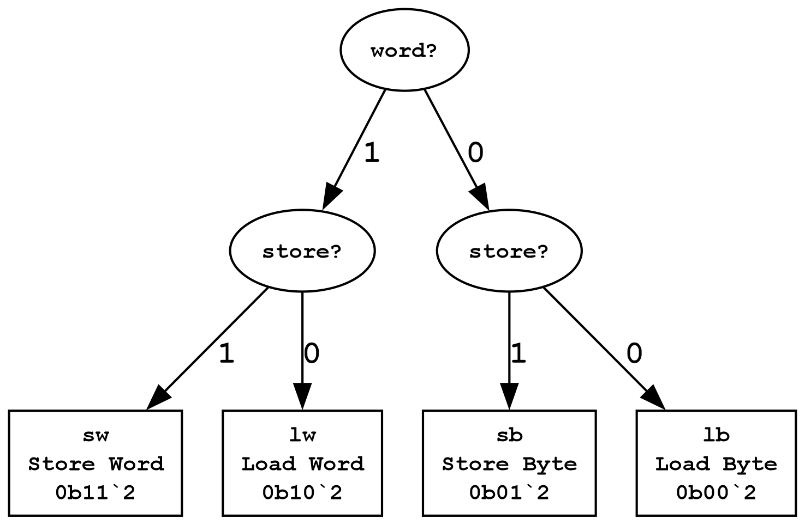
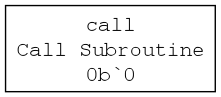
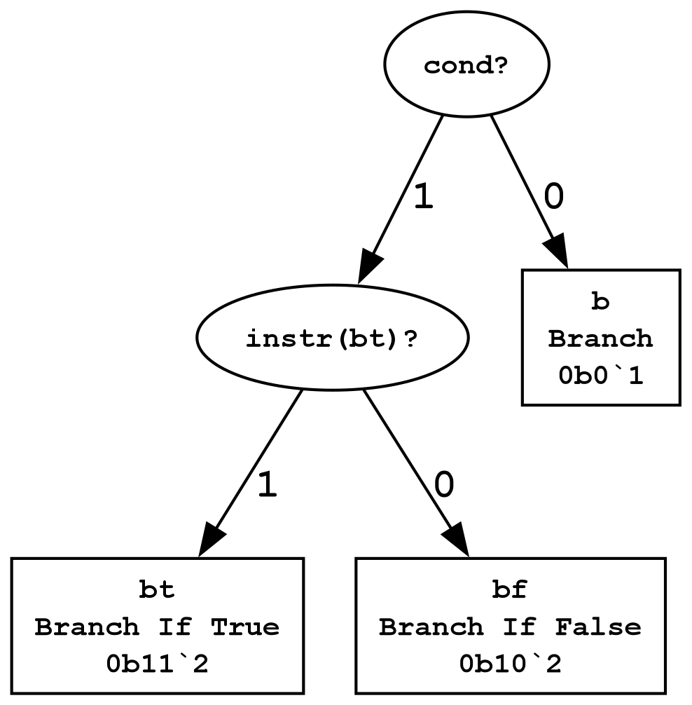
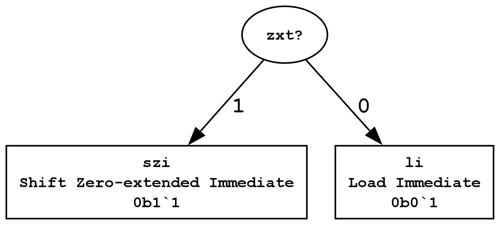
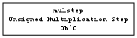
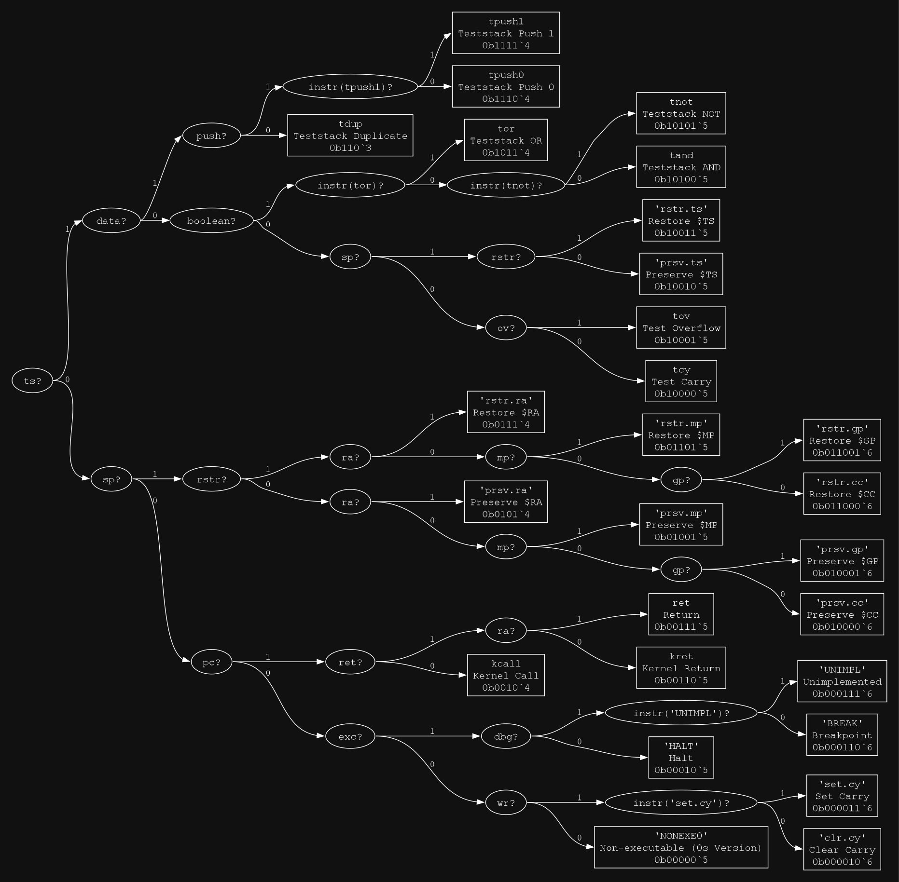

# Instructions


## Instruction Counts by Format


| Generic format | Description | Available Opcodes | Assigned | Utilization |
|:---:|:----|:---:|:---:|:---:|
| [`rri`](#instruction-format-rri) | Register-register-immediate | 4 | 4 | 100% |
| [`subr`](#instruction-format-subr) | Subroutine Call | 1 | 1 | 100% |
| [`b`](#instruction-format-b) | Branch | 4 | 3 | 75% |
| [`li`](#instruction-format-li) | Load Immediate | 2 | 2 | 100% |
| [`ri(_)`](#instruction-format-ri_) | Register-immediate | 48 | 25 | 52% |
| [`ext`](#instruction-format-ext) | Reserved for Extension | 4096 | 0 | 0% |
| [`rrr`](#instruction-format-rrr) | Register-register-register | 4 | 1 | 25% |
| [`rr(_)`](#instruction-format-rr_) | Register-register | 28 | 14 | 50% |
| [`r(_)`](#instruction-format-r_) | Register | 24 | 12 | 50% |
| [`o`](#instruction-format-o) | Opcode | 64 | 28 | 44% |
|  | **Totals (excluding `ext`)** | **179** | **90** | **50%** |


## Instruction Listing


| `rri` | `subr` | `b` | `li` | `ri(_)` | `rrr` | `rr(_)` | `r(_)` | `o` |
|:---:|:---:|:---:|:---:|:---:|:---:|:---:|:---:|:---:|
| [`lb`](#the-lb-instruction) | [`call`](#the-call-instruction) | [`b`](#the-b-instruction) | [`li`](#the-li-instruction) | [`lgb`](#the-lgb-instruction) | [`mulstep`](#the-mulstep-instruction) | [`add`](#the-add-instruction) | [`pushb`](#the-pushb-instruction) | [`NONEXE0`](#the-nonexe0-instruction) |
| [`lw`](#the-lw-instruction) |  | [`bt`](#the-bt-instruction) | [`szi`](#the-szi-instruction) | [`lgw`](#the-lgw-instruction) |  | [`sub`](#the-sub-instruction) | [`pushw`](#the-pushw-instruction) | [`UNIMPL`](#the-unimpl-instruction) |
| [`sb`](#the-sb-instruction) |  | [`bf`](#the-bf-instruction) |  | [`sgb`](#the-sgb-instruction) |  | [`and`](#the-and-instruction) | [`popb`](#the-popb-instruction) | [`BREAK`](#the-break-instruction) |
| [`sw`](#the-sw-instruction) |  |  |  | [`sgw`](#the-sgw-instruction) |  | [`or`](#the-or-instruction) | [`popw`](#the-popw-instruction) | [`kret`](#the-kret-instruction) |
|  |  |  |  | [`tbit`](#the-tbit-instruction) |  | [`xor`](#the-xor-instruction) | [`callr`](#the-callr-instruction) | [`kcall`](#the-kcall-instruction) |
|  |  |  |  | [`cbit`](#the-cbit-instruction) |  | [`mov`](#the-mov-instruction) | [`jr`](#the-jr-instruction) | [`ret`](#the-ret-instruction) |
|  |  |  |  | [`sbit`](#the-sbit-instruction) |  | [`addcy`](#the-addcy-instruction) | [`neg`](#the-neg-instruction) | [`tov`](#the-tov-instruction) |
|  |  |  |  | [`tli`](#the-tli-instruction) |  | [`subcy`](#the-subcy-instruction) | [`seb`](#the-seb-instruction) | [`tcy`](#the-tcy-instruction) |
|  |  |  |  | [`tgei`](#the-tgei-instruction) |  | [`tl`](#the-tl-instruction) | [`rd.mp.lo`](#the-rdmplo-instruction) | [`clr.cy`](#the-clrcy-instruction) |
|  |  |  |  | [`tbi`](#the-tbi-instruction) |  | [`tge`](#the-tge-instruction) | [`rd.mp.hi`](#the-rdmphi-instruction) | [`set.cy`](#the-setcy-instruction) |
|  |  |  |  | [`taei`](#the-taei-instruction) |  | [`tb`](#the-tb-instruction) | [`rd.gp`](#the-rdgp-instruction) | [`tpush0`](#the-tpush0-instruction) |
|  |  |  |  | [`tnei`](#the-tnei-instruction) |  | [`tae`](#the-tae-instruction) | [`wr.gp`](#the-wrgp-instruction) | [`tpush1`](#the-tpush1-instruction) |
|  |  |  |  | [`teqi`](#the-teqi-instruction) |  | [`tne`](#the-tne-instruction) |  | [`tnot`](#the-tnot-instruction) |
|  |  |  |  | [`addi`](#the-addi-instruction) |  | [`teq`](#the-teq-instruction) |  | [`tand`](#the-tand-instruction) |
|  |  |  |  | [`andi`](#the-andi-instruction) |  |  |  | [`tor`](#the-tor-instruction) |
|  |  |  |  | [`ori`](#the-ori-instruction) |  |  |  | [`tdup`](#the-tdup-instruction) |
|  |  |  |  | [`xori`](#the-xori-instruction) |  |  |  | [`prsv.mp`](#the-prsvmp-instruction) |
|  |  |  |  | [`addicy`](#the-addicy-instruction) |  |  |  | [`rstr.mp`](#the-rstrmp-instruction) |
|  |  |  |  | [`subicy`](#the-subicy-instruction) |  |  |  | [`prsv.ts`](#the-prsvts-instruction) |
|  |  |  |  | [`lsr`](#the-lsr-instruction) |  |  |  | [`rstr.ts`](#the-rstrts-instruction) |
|  |  |  |  | [`lsl`](#the-lsl-instruction) |  |  |  | [`prsv.ra`](#the-prsvra-instruction) |
|  |  |  |  | [`asr`](#the-asr-instruction) |  |  |  | [`rstr.ra`](#the-rstrra-instruction) |
|  |  |  |  | [`tbitm`](#the-tbitm-instruction) |  |  |  | [`prsv.gp`](#the-prsvgp-instruction) |
|  |  |  |  | [`cbitm`](#the-cbitm-instruction) |  |  |  | [`rstr.gp`](#the-rstrgp-instruction) |
|  |  |  |  | [`sbitm`](#the-sbitm-instruction) |  |  |  | [`prsv.cc`](#the-prsvcc-instruction) |
|  |  |  |  |  |  |  |  | [`rstr.cc`](#the-rstrcc-instruction) |
|  |  |  |  |  |  |  |  | [`sleep`](#the-sleep-instruction) |
|  |  |  |  |  |  |  |  | [`vijt`](#the-vijt-instruction) |

## Synthetic Instructions


| Synth. Instr. | Description | Expansion | Reversability |
|:---:|:---:|:---:|:---:|
| `clr r` | Clear a register | `xor r, r` | Reversable |
| `nop` | The no-op instruction | `ori $sp, 0` | Reversable |
| `incr r` | Increment a register | `addi r, 1` | Reversable |
| `decr r` | Increment a register | `addi r, -1` | Reversable |
| `inv r` | Bitwise inversion (complement) | `xori r, -1` | Reversable |
| `not r` | Invert a boolean (0 or 1) | `xori r, 1` | Reversable |
| `tg r1, r2` | Test greater-than | `tl r2, r1` | One Way |
| `tle r1, r2` | Test Less-than or Equal | `tge r2, r1` | One Way |
| `ta r1, r2` | Test Above | `ta r2, r1` | One Way |
| `tbe r1, r2` | Test Below or Equal | `tae r2, r1` | One Way |
| `HALT` | Halt the processor (infinite loop) | `b 0` | Reversable |

## Instruction Format Breakdown


### Instruction Format Layouts


| Format | [Bit Pattern](#legend) | Opcodes Available | Assigned | Utilization | Range of Immediate |
|:----|:---:|:---:|:---:|:---:|:---:|
| [`rri`](#format-rri) | `11ooiiiiiisssrrr` | 4 | 4 | 100% | `imm6` in `[-32, 31]` or `[0, 63]` |
| [`subr`](#format-subr) | `101iiiiiiiiiiiii` | 1 | 1 | 100% | `imm13` in `[-4096, 4095]` or `[0, 8191]` |
| [`b`](#format-b) | `1001ooiiiiiiiiii` | 4 | 3 | 75% | `imm10` in `[-512, 511]` or `[0, 1023]` |
| [`li`](#format-li) | `1000oiiiiiiiirrr` | 2 | 2 | 100% | `imm8` in `[-128, 127]` or `[0, 255]` |
| [`ri(1)`](#format-ri1) | `01oooooiiiiiirrr` | 32 | 25 | 78% | `imm6` in `[-32, 31]` or `[0, 63]` |
| [`ri(2)`](#format-ri2) | `001ooooiiiiiirrr` | 16 | 0 | 0% | `imm6` in `[-32, 31]` or `[0, 63]` |
| [`ext`](#format-ext) | `0001oooooooooooo` | 4096 | 0 | 0% |  |
| [`rrr`](#format-rrr) | `00001ootttsssrrr` | 4 | 1 | 25% |  |
| [`rr(1)`](#format-rr1) | `000001oooosssrrr` | 16 | 8 | 50% |  |
| [`rr(2)`](#format-rr2) | `0000001ooosssrrr` | 8 | 4 | 50% |  |
| [`rr(3)`](#format-rr3) | `00000001oosssrrr` | 4 | 2 | 50% |  |
| [`r(1)`](#format-r1) | `000000001oooorrr` | 16 | 8 | 50% |  |
| [`r(2)`](#format-r2) | `0000000001ooorrr` | 8 | 4 | 50% |  |
| [`o`](#format-o) | `0000000000oooooo` | 64 | 28 | 44% |  |

### Legend


| Bit Symbol | Description |
|:---:|:----|
| `o` | A bit in the instruction's opcode. |
| `i` | A bit in an immediate value. |
| `r` | A bit in a register specifier. |
| `s` | A bit in a second register specifier. |
| `t` | A bit in a third register specifier. |
| `0` | A literal `0` embedded in the instruction. |
| `1` | A literal `1` embedded in the instruction. |


## Instruction Specifications


### Instruction Format `rri`


#### Format `rri`




##### The `lb` Instruction

**Load Byte** --- Load a byte from memory into a register.

###### Examples

- `lb w, [sp+12]`

###### Layout


| Format Prefix | Opcode | Bit Layout | Immediate Bits | Immediate Range |
|:---:|:---:|:---:|:---:|:---:|
| `rri` = 0b11 | 0b11 | `1111iiiiiisssrrr` |

###### Semantics

```
[reg(r, rs), reg(s, rd)+simm(simm)]
-----------------------------------
let ptr := rs\s+sxt(simm)\u;
rd <- zxt([ptr])
```

###### Module

**`base`**

--------------

##### The `lw` Instruction

**Load Word** --- Load a word from memory into a register.

###### Examples

- `lw w, [sp+12]`

###### Layout


| Format Prefix | Opcode | Bit Layout | Immediate Bits | Immediate Range |
|:---:|:---:|:---:|:---:|:---:|
| `rri` = 0b11 | 0b01 | `1101iiiiiisssrrr` |

###### Semantics

```
[reg(r, rs), reg(s, rd)+simm(simm)]
------------------------------------
let ptr := rs\s+sxt(simm)and-2\16\u;
rd <- {[ptr+1], [ptr]}
```

###### Module

**`base`**

--------------

##### The `sb` Instruction

**Store Byte** --- Store a byte from a register into memory.

###### Examples

- `sb [sp-20], x`

###### Layout


| Format Prefix | Opcode | Bit Layout | Immediate Bits | Immediate Range |
|:---:|:---:|:---:|:---:|:---:|
| `rri` = 0b11 | 0b10 | `1110iiiiiisssrrr` |

###### Semantics

```
[reg(r, rd)+simm(simm), reg(s, rs)]
-----------------------------------
let ptr := rd\s+sxt(simm);
[ptr\u] <- lo(rs)
```

###### Module

**`base`**

--------------

##### The `sw` Instruction

**Store Word** --- Store a word from a register into memory.

###### Examples

- `sw [sp-20], x`

###### Layout


| Format Prefix | Opcode | Bit Layout | Immediate Bits | Immediate Range |
|:---:|:---:|:---:|:---:|:---:|
| `rri` = 0b11 | 0b00 | `1100iiiiiisssrrr` |

###### Semantics

```
[reg(r, rd)+simm(simm), reg(s, rs)]
------------------------------------
let ptr := rd\s+sxt(simm)and65534\u;
[ptr] <- lo(rs);
[ptr+1] <- hi(rs)
```

###### Module

**`base`**

--------------

### Instruction Format `subr`


#### Format `subr`




##### The `call` Instruction

**Call Subroutine** --- Call a subroutine at the specified address.

###### Examples

- `call SOME_LABEL`

###### Layout


| Format Prefix | Opcode | Bit Layout | Immediate Bits | Immediate Range |
|:---:|:---:|:---:|:---:|:---:|
| `subr` = 0b101 | NONE | `101iiiiiiiiiiiii` | 13 | `[-4096, 4095]` |

###### Semantics

```
[simm(arg)]
-------------------------------------
let offset := arg;
$PC <- $PC\s+sxt(offset)<<subr_align;
$RA <- $PC+2
```

###### Module

**`base`**

--------------

### Instruction Format `b`


#### Format `b`




##### The `b` Instruction

**Branch** --- Branch to the specified address by adding the immediate offset to `$PC`.

###### Examples

- `b SOME_LABEL`

###### Layout


| Format Prefix | Opcode | Bit Layout | Immediate Bits | Immediate Range |
|:---:|:---:|:---:|:---:|:---:|
| `b` = 0b1001 | 0b00 | `100100iiiiiiiiii` | 10 | `[-512, 511]` |

###### Semantics

```
[simm(arg)]
------------------------
let offset := arg;
$PC <- $PC\s+sxt(offset)
```

###### Module

**`base`**

--------------

##### The `bt` Instruction

**Branch If True** --- Branch to the specified address if the condition is true by adding the immediate offset to `$PC`.

###### Examples

- `bt SOME_LABEL`

###### Layout


| Format Prefix | Opcode | Bit Layout | Immediate Bits | Immediate Range |
|:---:|:---:|:---:|:---:|:---:|
| `b` = 0b1001 | 0b10 | `100110iiiiiiiiii` | 10 | `[-512, 511]` |

###### Semantics

```
[simm(arg)]
----------------------------
if b_pop($TS) {
    let offset := arg;
    $PC <- $PC\s+sxt(offset)
}
```

###### Module

**`base`**

--------------

##### The `bf` Instruction

**Branch If False** --- Branch to the specified address if the condition is false by adding the immediate offset to `$PC`.

###### Examples

- `bf SOME_LABEL`

###### Layout


| Format Prefix | Opcode | Bit Layout | Immediate Bits | Immediate Range |
|:---:|:---:|:---:|:---:|:---:|
| `b` = 0b1001 | 0b11 | `100111iiiiiiiiii` | 10 | `[-512, 511]` |

###### Semantics

```
[simm(arg)]
----------------------------
if ~b_pop($TS) {
    let offset := arg;
    $PC <- $PC\s+sxt(offset)
}
```

###### Module

**`base`**

--------------

### Instruction Format `li`


#### Format `li`




##### The `li` Instruction

**Load Immediate** --- Load an immediate value into a register.

###### Examples

- `li x, 123`

###### Layout


| Format Prefix | Opcode | Bit Layout | Immediate Bits | Immediate Range |
|:---:|:---:|:---:|:---:|:---:|
| `li` = 0b1000 | 0b0 | `10000iiiiiiiirrr` | 8 | `[-128, 127]` |

###### Semantics

```
[reg(r, rd), simm(simm)]
------------------------
rd <- sxt(simm)
```

###### Module

**`base`**

--------------

##### The `szi` Instruction

**Shift Zero-extended Immediate** --- Left-shift a zero-extended immediate value into a register.

###### Examples

- `szi x, 0xB3`

###### Layout


| Format Prefix | Opcode | Bit Layout | Immediate Bits | Immediate Range |
|:---:|:---:|:---:|:---:|:---:|
| `li` = 0b1000 | 0b1 | `10001iiiiiiiirrr` | 8 | `[0, 255]` |

###### Semantics

```
[reg(r, rd), imm(imm)]
--------------------------
rd <- rd<<8\16 or zxt(imm)
```

###### Module

**`base`**

--------------

### Instruction Format `ri(_)`


#### Format `ri(1)`


.svg)

##### The `lgb` Instruction

**Load Global Byte** --- Load a byte from a memory address offset from `$GP`.

###### Examples

- `lgb x, [gp+8]`

###### Layout


| Format Prefix | Opcode | Bit Layout | Immediate Bits | Immediate Range |
|:---:|:---:|:---:|:---:|:---:|
| `ri(1)` = 0b01 | 0b00111 | `0100111iiiiiirrr` |

###### Semantics

```
[reg(r, rd), reg(s, rs)+imm(disp)]
----------------------------------
rd <- zxt([$GP\u+zxt(disp)])
```

###### Module

**`globals`**

--------------

##### The `lgw` Instruction

**Load Global Word** --- Load a word from a memory address offset from `$GP`.

###### Examples

- `lgw x, [gp+8]`

###### Layout


| Format Prefix | Opcode | Bit Layout | Immediate Bits | Immediate Range |
|:---:|:---:|:---:|:---:|:---:|
| `ri(1)` = 0b01 | 0b00101 | `0100101iiiiiirrr` |

###### Semantics

```
[reg(r, rd), reg(s, rs)+imm(disp)]
-------------------------------------
let ptr := $GP\u+zxt(disp)and65534\u;
rd <- {[ptr+1], [ptr]}
```

###### Module

**`globals`**

--------------

##### The `sgb` Instruction

**Store Global Byte** --- Store a byte into memory address offset from `$GP`.

###### Examples

- `sgb [gp+8], x`

###### Layout


| Format Prefix | Opcode | Bit Layout | Immediate Bits | Immediate Range |
|:---:|:---:|:---:|:---:|:---:|
| `ri(1)` = 0b01 | 0b00110 | `0100110iiiiiirrr` |

###### Semantics

```
[reg(r, rd)+imm(disp), reg(s, rs)]
----------------------------------
[$GP\u+zxt(disp)] <- lo(rs)
```

###### Module

**`globals`**

--------------

##### The `sgw` Instruction

**Store Global Word** --- Store a word into memory address offset from `$GP`.

###### Examples

- `sgw [gp+8], x`

###### Layout


| Format Prefix | Opcode | Bit Layout | Immediate Bits | Immediate Range |
|:---:|:---:|:---:|:---:|:---:|
| `ri(1)` = 0b01 | 0b00100 | `0100100iiiiiirrr` |

###### Semantics

```
[reg(r, rd)+imm(disp), reg(s, rs)]
-------------------------------------
let ptr := $GP\u+zxt(disp)and65534\u;
{[ptr+1], [ptr]} <- rs
```

###### Module

**`globals`**

--------------

##### The `tbit` Instruction

**Test Bit** --- Test a specific bit in a register, modifying `$TS`.

###### Examples

- `tbit 12, w`

###### Layout


| Format Prefix | Opcode | Bit Layout | Immediate Bits | Immediate Range |
|:---:|:---:|:---:|:---:|:---:|
| `ri(1)` = 0b01 | 0b11000 | `0111000iiiiiirrr` | 6 | `[0, 63]` |

###### Semantics

```
[imm(bit_idx), reg(r, rs)]
-------------------------------------
let shamt := bitslice(bit_idx, 3..0);
let bit := rs>>shamt\u and 1;
b_push($TS, bit==1)
```

###### Module

**`bittests`**

--------------

##### The `cbit` Instruction

**Clear Bit** --- Clear a specific bit in a register.

###### Examples

- `cbit 9, v`

###### Layout


| Format Prefix | Opcode | Bit Layout | Immediate Bits | Immediate Range |
|:---:|:---:|:---:|:---:|:---:|
| `ri(1)` = 0b01 | 0b01101 | `0101101iiiiiirrr` | 6 | `[0, 63]` |

###### Semantics

```
[imm(bit_idx), reg(r, rd)]
-------------------------------------
let idx := bitslice(bit_idx, 3..0)\u;
let mask := ~ (1<<idx);
rd <- rd and mask
```

###### Module

**`bittests`**

--------------

##### The `sbit` Instruction

**Set Bit** --- Set a specific bit in a register.

###### Examples

- `sbit 15, a`

###### Layout


| Format Prefix | Opcode | Bit Layout | Immediate Bits | Immediate Range |
|:---:|:---:|:---:|:---:|:---:|
| `ri(1)` = 0b01 | 0b11001 | `0111001iiiiiirrr` | 6 | `[0, 63]` |

###### Semantics

```
[imm(bit_idx), reg(r, rd)]
-------------------------------------
let idx := bitslice(bit_idx, 3..0)\u;
let mask := ~ (1<<idx);
rd <- rd or mask
```

###### Module

**`bittests`**

--------------

##### The `tli` Instruction

**Test Less-than Immediate** --- Test if a register value is less than an immediate value.

###### Examples

- `tli x, -5`

###### Layout


| Format Prefix | Opcode | Bit Layout | Immediate Bits | Immediate Range |
|:---:|:---:|:---:|:---:|:---:|
| `ri(1)` = 0b01 | 0b01111 | `0101111iiiiiirrr` | 6 | `[-32, 31]` |

###### Semantics

```
[reg(r, rs), simm(simm)]
----------------------------------------------
b_push($TS, compare(rs\s, <(s\16), sxt(simm)))
```

###### Module

**`imms`**

--------------

##### The `tgei` Instruction

**Test Greater-than or Equal Immediate** --- Test if a register value is greater than or equal to an immediate value.

###### Examples

- `tgei x, -5`

###### Layout


| Format Prefix | Opcode | Bit Layout | Immediate Bits | Immediate Range |
|:---:|:---:|:---:|:---:|:---:|
| `ri(1)` = 0b01 | 0b01101 | `0101101iiiiiirrr` | 6 | `[-32, 31]` |

###### Semantics

```
[reg(r, rs), simm(simm)]
-----------------------------------------------
b_push($TS, compare(rs\s, >=(s\16), sxt(simm)))
```

###### Module

**`imms`**

--------------

##### The `tbi` Instruction

**Test Below Immediate** --- Test if a register value is below an immediate value.

###### Examples

- `tbi x, 10`

###### Layout


| Format Prefix | Opcode | Bit Layout | Immediate Bits | Immediate Range |
|:---:|:---:|:---:|:---:|:---:|
| `ri(1)` = 0b01 | 0b01110 | `0101110iiiiiirrr` | 6 | `[0, 63]` |

###### Semantics

```
[reg(r, rs), imm(imm)]
---------------------------------------------
b_push($TS, compare(rs\u, <(u\16), zxt(imm)))
```

###### Module

**`imms`**

--------------

##### The `taei` Instruction

**Test Above or Equal** --- Test if a register value is above or equal to an immediate value.

###### Examples

- `taei x, 10`

###### Layout


| Format Prefix | Opcode | Bit Layout | Immediate Bits | Immediate Range |
|:---:|:---:|:---:|:---:|:---:|
| `ri(1)` = 0b01 | 0b01100 | `0101100iiiiiirrr` | 6 | `[0, 63]` |

###### Semantics

```
[reg(r, rs), imm(imm)]
----------------------------------------------
b_push($TS, compare(rs\u, >=(u\16), zxt(imm)))
```

###### Module

**`imms`**

--------------

##### The `tnei` Instruction

**Test Not Equal Immediate** --- Test if a register value is not equal to an immediate value.

###### Examples

- `tnei x, 0`

###### Layout


| Format Prefix | Opcode | Bit Layout | Immediate Bits | Immediate Range |
|:---:|:---:|:---:|:---:|:---:|
| `ri(1)` = 0b01 | 0b00101 | `0100101iiiiiirrr` | 6 | `[-32, 31]` |

###### Semantics

```
[reg(r, rs), simm(simm)]
----------------------------
b_push($TS, rs\s\=sxt(simm))
```

###### Module

**`imms`**

--------------

##### The `teqi` Instruction

**Test Equal Immediate** --- Test if a register value is equal to an immediate value.

###### Examples

- `teqi x, -5`

###### Layout


| Format Prefix | Opcode | Bit Layout | Immediate Bits | Immediate Range |
|:---:|:---:|:---:|:---:|:---:|
| `ri(1)` = 0b01 | 0b00100 | `0100100iiiiiirrr` | 6 | `[-32, 31]` |

###### Semantics

```
[reg(r, rs), simm(simm)]
----------------------------
b_push($TS, rs\s==sxt(simm))
```

###### Module

**`imms`**

--------------

##### The `addi` Instruction

**Add Immediate** --- Add an immediate value to a register.

###### Examples

- `addi x, -5`

###### Layout


| Format Prefix | Opcode | Bit Layout | Immediate Bits | Immediate Range |
|:---:|:---:|:---:|:---:|:---:|
| `ri(1)` = 0b01 | 0b00000 | `0100000iiiiiirrr` | 6 | `[-32, 31]` |

###### Semantics

```
[reg(r, rd), simm(simm)]
------------------------
rd <- rd\s+sxt(simm)
```

###### Module

**`imms`**

--------------

##### The `andi` Instruction

**AND Immediate** --- Perform a bitwise AND between a register and an immediate value.

###### Examples

- `andi x, 3`

###### Layout


| Format Prefix | Opcode | Bit Layout | Immediate Bits | Immediate Range |
|:---:|:---:|:---:|:---:|:---:|
| `ri(1)` = 0b01 | 0b01011 | `0101011iiiiiirrr` | 6 | `[-32, 31]` |

###### Semantics

```
[reg(r, rd), simm(simm)]
------------------------
rd <- rd and sxt(simm)
```

###### Module

**`imms`**

--------------

##### The `ori` Instruction

**OR Immediate** --- Perform a bitwise OR between a register and an immediate value.

###### Examples

- `ori x, 3`

###### Layout


| Format Prefix | Opcode | Bit Layout | Immediate Bits | Immediate Range |
|:---:|:---:|:---:|:---:|:---:|
| `ri(1)` = 0b01 | 0b10100 | `0110100iiiiiirrr` | 6 | `[-32, 31]` |

###### Semantics

```
[reg(r, rd), simm(simm)]
------------------------
rd <- rd or sxt(simm)
```

###### Module

**`imms`**

--------------

##### The `xori` Instruction

**XOR Immediate** --- Perform a bitwise XOR between a register and an immediate value.

###### Examples

- `xori x, 3`

###### Layout


| Format Prefix | Opcode | Bit Layout | Immediate Bits | Immediate Range |
|:---:|:---:|:---:|:---:|:---:|
| `ri(1)` = 0b01 | 0b10101 | `0110101iiiiiirrr` | 6 | `[-32, 31]` |

###### Semantics

```
[reg(r, rd), simm(simm)]
------------------------
rd <- rd xor sxt(simm)
```

###### Module

**`imms`**

--------------

##### The `addicy` Instruction

**Add Immediate with Carry** --- Add an immediate value and the carry bit to a register.

###### Examples

- `addicy x, 3`

###### Layout


| Format Prefix | Opcode | Bit Layout | Immediate Bits | Immediate Range |
|:---:|:---:|:---:|:---:|:---:|
| `ri(1)` = 0b01 | 0b00011 | `0100011iiiiiirrr` | 6 | `[-32, 31]` |

###### Semantics

```
[reg(r, rd), simm(simm)]
-----------------------------------------------------
rd <- rd\s+sxt(simm)+bit($CC, carry_flag_bit)\16\s;
bit($CC, carry_flag_bit) <- attr(cpu/alu/carryout);
bit($CC, overflow_flag_bit) <- attr(cpu/alu/overflow)
```

###### Module

**`imms`**

--------------

##### The `subicy` Instruction

**Subtract Immediate with Carry** --- Sutract an immediate value and the carry bit from a register.

###### Examples

- `subicy x, 3`

###### Layout


| Format Prefix | Opcode | Bit Layout | Immediate Bits | Immediate Range |
|:---:|:---:|:---:|:---:|:---:|
| `ri(1)` = 0b01 | 0b00010 | `0100010iiiiiirrr` | 6 | `[-32, 31]` |

###### Semantics

```
[reg(r, rd), simm(simm)]
-----------------------------------------------------
rd <- rd\s-sxt(simm)-bit($CC, carry_flag_bit)\16\s;
bit($CC, carry_flag_bit) <- attr(cpu/alu/carryout);
bit($CC, overflow_flag_bit) <- attr(cpu/alu/overflow)
```

###### Module

**`imms`**

--------------

##### The `lsr` Instruction

**Logical Shift Right** --- Perform a logical shift right on a register by an immediate value.

###### Examples

- `lsr x, 15`

###### Layout


| Format Prefix | Opcode | Bit Layout | Immediate Bits | Immediate Range |
|:---:|:---:|:---:|:---:|:---:|
| `ri(1)` = 0b01 | 0b10010 | `0110010iiiiiirrr` | 6 | `[0, 63]` |

###### Semantics

```
[reg(r, rd), imm(imm)]
----------------------
rd <- rd>>imm
```

###### Module

**`base`**

--------------

##### The `lsl` Instruction

**Logical Shift Left** --- Perform a logical shift left on a register by an immediate value.

###### Examples

- `lsl x, 8`

###### Layout


| Format Prefix | Opcode | Bit Layout | Immediate Bits | Immediate Range |
|:---:|:---:|:---:|:---:|:---:|
| `ri(1)` = 0b01 | 0b01000 | `0101000iiiiiirrr` | 6 | `[0, 63]` |

###### Semantics

```
[reg(r, rd), imm(imm)]
--------------------------------------------
bit($CC, carry_flag_bit) <- bit(rd, 16-imm);
rd <- rd<<imm\i\16
```

###### Module

**`base`**

--------------

##### The `asr` Instruction

**Arithmetic Shift Right** --- Perform an arithmetic shift right on a register by an immediate value.

###### Examples

- `asr x, 3`

###### Layout


| Format Prefix | Opcode | Bit Layout | Immediate Bits | Immediate Range |
|:---:|:---:|:---:|:---:|:---:|
| `ri(1)` = 0b01 | 0b10011 | `0110011iiiiiirrr` | 6 | `[0, 63]` |

###### Semantics

```
[reg(r, rd), imm(imm)]
--------------------------------------------------------------
let sign_extension := sxt(bit(rd, 15)-1)<<(reg_size_bits-imm);
rd <- rd>>imm or sign_extension
```

###### Module

**`base`**

--------------

##### The `tbitm` Instruction

**Test Bit in Memory** --- 

###### Examples

- `tbitm [x], 3`

###### Layout


| Format Prefix | Opcode | Bit Layout | Immediate Bits | Immediate Range |
|:---:|:---:|:---:|:---:|:---:|
| `ri(1)` = 0b01 | 0b11100 | `0111100iiiiiirrr` | 6 | `[0, 63]` |

###### Semantics

```
[reg(r, rs), imm(imm)]
---------------------------
b_push($TS, bit([rs], imm))
```

###### Module

**`bittests`**

--------------

##### The `cbitm` Instruction

**Clear Bit in Memory** --- 

###### Examples

- `cbitm [x], 3`

###### Layout


| Format Prefix | Opcode | Bit Layout | Immediate Bits | Immediate Range |
|:---:|:---:|:---:|:---:|:---:|
| `ri(1)` = 0b01 | 0b01111 | `0101111iiiiiirrr` | 6 | `[0, 63]` |

###### Semantics

```
[reg(r, rs), imm(imm)]
-------------------------
[rs] <- [rs]and~ (1<<imm)
```

###### Module

**`bittests`**

--------------

##### The `sbitm` Instruction

**Set Bit in Memory** --- 

###### Examples

- `sbitm [x], 3`

###### Layout


| Format Prefix | Opcode | Bit Layout | Immediate Bits | Immediate Range |
|:---:|:---:|:---:|:---:|:---:|
| `ri(1)` = 0b01 | 0b11101 | `0111101iiiiiirrr` | 6 | `[0, 63]` |

###### Semantics

```
[reg(r, rs), imm(imm)]
----------------------
[rs] <- [rs]or1<<imm
```

###### Module

**`bittests`**

--------------

#### Format `ri(2)`


.svg)

### Instruction Format `rrr`


#### Format `rrr`




##### The `mulstep` Instruction

**Unsigned Multiplication Step** --- Computes one step in a full 16-bit by 16-bit unsigned multiplication.

###### Examples

- `mulstep x:y, z`

###### Layout


| Format Prefix | Opcode | Bit Layout |
|:---:|:---:|:---:|
| `rrr` = 0b00001 | 0b00 | `0000100tttsssrrr` |

###### Semantics

```
[reg(t, multiplicand_hi):reg(s, multiplicand_lo), reg(r, multiplier)]
---------------------------------------------------------------------
let mask := ~ ((multiplier and 1)-1);
let masked_lo := multiplicand_lo and mask;
let masked_hi := multiplicand_hi and mask;
lo($MP) <- lo($MP)+masked_lo;
hi($MP) <- hi($MP)+masked_hi+attr(cpu/alu/carryout);
let shift_cout := bit(multiplicand_lo, reg_size_bits-1);
multiplicand_lo <- multiplicand_lo<<1;
multiplicand_hi <- multiplicand_hi<<(1+shift_cout);
multiplier <- multiplier div 2
```

###### Module

**`mul`**

--------------

### Instruction Format `rr(_)`


#### Format `rr(1)`


.svg)

##### The `add` Instruction

**Add** --- Add the values of two registers.

###### Examples

- `add x, y`

###### Layout


| Format Prefix | Opcode | Bit Layout |
|:---:|:---:|:---:|
| `rr(1)` = 0b000001 | 0b0110 | `0000010110sssrrr` |

###### Semantics

```
[reg(r, rd), reg(s, rs)]
------------------------
rd <- rd+rs
```

###### Module

**`base`**

--------------

##### The `sub` Instruction

**Subtract** --- Subtract the value of one register from another.

###### Examples

- `sub x, y`

###### Layout


| Format Prefix | Opcode | Bit Layout |
|:---:|:---:|:---:|
| `rr(1)` = 0b000001 | 0b0100 | `0000010100sssrrr` |

###### Semantics

```
[reg(r, rd), reg(s, rs)]
------------------------
rd <- rd-rs
```

###### Module

**`base`**

--------------

##### The `and` Instruction

**AND** --- Perform a bitwise AND between two registers.

###### Examples

- `and x, y`

###### Layout


| Format Prefix | Opcode | Bit Layout |
|:---:|:---:|:---:|
| `rr(1)` = 0b000001 | 0b0001 | `0000010001sssrrr` |

###### Semantics

```
[reg(r, rd), reg(s, rs)]
------------------------
rd <- rd and rs
```

###### Module

**`base`**

--------------

##### The `or` Instruction

**OR** --- Perform a bitwise OR between two registers.

###### Examples

- `or x, y`

###### Layout


| Format Prefix | Opcode | Bit Layout |
|:---:|:---:|:---:|
| `rr(1)` = 0b000001 | 0b00010 | `00000100010sssrrr` |

###### Semantics

```
[reg(r, rd), reg(s, rs)]
------------------------
rd <- rd or rs
```

###### Module

**`base`**

--------------

##### The `xor` Instruction

**XOR** --- Perform a bitwise XOR between two registers.

###### Examples

- `xor x, y`

###### Layout


| Format Prefix | Opcode | Bit Layout |
|:---:|:---:|:---:|
| `rr(1)` = 0b000001 | 0b00011 | `00000100011sssrrr` |

###### Semantics

```
[reg(r, rd), reg(s, rs)]
------------------------
rd <- rd xor rs
```

###### Module

**`base`**

--------------

##### The `mov` Instruction

**Move** --- Move the value from one register to another.

###### Examples

- `mov x, y`

###### Layout


| Format Prefix | Opcode | Bit Layout |
|:---:|:---:|:---:|
| `rr(1)` = 0b000001 | 0b0000 | `0000010000sssrrr` |

###### Semantics

```
[reg(r, rd), reg(s, rs)]
------------------------
rd <- rs
```

###### Module

**`base`**

--------------

##### The `addcy` Instruction

**Add with Carry** --- Add the values of two registers with carry.

###### Examples

- `addcy x, y`

###### Layout


| Format Prefix | Opcode | Bit Layout |
|:---:|:---:|:---:|
| `rr(1)` = 0b000001 | 0b0111 | `0000010111sssrrr` |

###### Semantics

```
[reg(r, rd), reg(s, rs)]
-----------------------------------------------------
rd <- rd+rs+bit($CC, carry_flag_bit)\16;
bit($CC, carry_flag_bit) <- attr(cpu/alu/carryout);
bit($CC, overflow_flag_bit) <- attr(cpu/alu/overflow)
```

###### Module

**`base`**

--------------

##### The `subcy` Instruction

**Subtract with Carry** --- Subtract the value of one register from another with carry.

###### Examples

- `subcy x, y`

###### Layout


| Format Prefix | Opcode | Bit Layout |
|:---:|:---:|:---:|
| `rr(1)` = 0b000001 | 0b0101 | `0000010101sssrrr` |

###### Semantics

```
[reg(r, rd), reg(s, rs)]
-----------------------------------------------------
rd <- rd-rs-bit($CC, carry_flag_bit)\16;
bit($CC, carry_flag_bit) <- attr(cpu/alu/carryout);
bit($CC, overflow_flag_bit) <- attr(cpu/alu/overflow)
```

###### Module

**`base`**

--------------

#### Format `rr(2)`


.svg)

##### The `tl` Instruction

**Test Less-than** --- Test if the value of one register is less than another.

###### Examples

- `tl x, y`

###### Layout


| Format Prefix | Opcode | Bit Layout |
|:---:|:---:|:---:|
| `rr(2)` = 0b0000001 | 0b1111 | `00000011111sssrrr` |

###### Semantics

```
[reg(r, r1), reg(s, r2)]
-------------------------------------
b_push($TS, compare(r1, <(s\16), r2))
```

###### Module

**`base`**

--------------

##### The `tge` Instruction

**Test Greater-than or Equal** --- Test if the value of one register is greater than or equal to another.

###### Examples

- `tge x, y`

###### Layout


| Format Prefix | Opcode | Bit Layout |
|:---:|:---:|:---:|
| `rr(2)` = 0b0000001 | 0b1101 | `00000011101sssrrr` |

###### Semantics

```
[reg(r, r1), reg(s, r2)]
--------------------------------------
b_push($TS, compare(r1, >=(s\16), r2))
```

###### Module

**`base`**

--------------

##### The `tb` Instruction

**Test Below** --- Test if the value of one register is below another.

###### Examples

- `tb x, y`

###### Layout


| Format Prefix | Opcode | Bit Layout |
|:---:|:---:|:---:|
| `rr(2)` = 0b0000001 | 0b1110 | `00000011110sssrrr` |

###### Semantics

```
[reg(r, r1), reg(s, r2)]
-------------------------------------
b_push($TS, compare(r1, <(u\16), r2))
```

###### Module

**`base`**

--------------

##### The `tae` Instruction

**Test Above or Equal** --- Test if the value of one register is above or equal to another.

###### Examples

- `tae x, y`

###### Layout


| Format Prefix | Opcode | Bit Layout |
|:---:|:---:|:---:|
| `rr(2)` = 0b0000001 | 0b1100 | `00000011100sssrrr` |

###### Semantics

```
[reg(r, r1), reg(s, r2)]
--------------------------------------
b_push($TS, compare(r1, >=(u\16), r2))
```

###### Module

**`base`**

--------------

#### Format `rr(3)`


.svg)

##### The `tne` Instruction

**Test Not Equal** --- Test if the value of one register is not equal to another.

###### Examples

- `tne x, y`

###### Layout


| Format Prefix | Opcode | Bit Layout |
|:---:|:---:|:---:|
| `rr(3)` = 0b00000001 | 0b101 | `00000001101sssrrr` |

###### Semantics

```
[reg(r, r1), reg(s, r2)]
------------------------
b_push($TS, r1\=r2)
```

###### Module

**`base`**

--------------

##### The `teq` Instruction

**Test Equal** --- Test if the value of one register is equal to another.

###### Examples

- `teq x, y`

###### Layout


| Format Prefix | Opcode | Bit Layout |
|:---:|:---:|:---:|
| `rr(3)` = 0b00000001 | 0b100 | `00000001100sssrrr` |

###### Semantics

```
[reg(r, r1), reg(s, r2)]
------------------------
b_push($TS, r1==r2)
```

###### Module

**`base`**

--------------

### Instruction Format `r(_)`


#### Format `r(1)`


.svg)

##### The `pushb` Instruction

**Push Byte** --- Push a byte from a register onto the stack.

###### Examples

- `pushb x`

###### Layout


| Format Prefix | Opcode | Bit Layout |
|:---:|:---:|:---:|
| `r(1)` = 0b000000001 | 0b0110 | `0000000010110rrr` |

###### Semantics

```
[reg(r, rs)]
------------
todo
```

###### Module

**`stack`**

--------------

##### The `pushw` Instruction

**Push Word** --- Push a word from a register onto the stack.

###### Examples

- `pushw x`

###### Layout


| Format Prefix | Opcode | Bit Layout |
|:---:|:---:|:---:|
| `r(1)` = 0b000000001 | 0b0100 | `0000000010100rrr` |

###### Semantics

```
[reg(r, rs)]
------------
todo
```

###### Module

**`stack`**

--------------

##### The `popb` Instruction

**Pop Byte** --- Pop a byte from the stack into a register.

###### Examples

- `popb x`

###### Layout


| Format Prefix | Opcode | Bit Layout |
|:---:|:---:|:---:|
| `r(1)` = 0b000000001 | 0b0111 | `0000000010111rrr` |

###### Semantics

```
[reg(r, rd)]
------------
todo
```

###### Module

**`stack`**

--------------

##### The `popw` Instruction

**Pop Word** --- Pop a word from the stack into a register.

###### Examples

- `popw x`

###### Layout


| Format Prefix | Opcode | Bit Layout |
|:---:|:---:|:---:|
| `r(1)` = 0b000000001 | 0b0101 | `0000000010101rrr` |

###### Semantics

```
[reg(r, rd)]
------------
todo
```

###### Module

**`stack`**

--------------

##### The `callr` Instruction

**Call Register** --- Call a subroutine at the address in a register.

###### Examples

- `callr x`

###### Layout


| Format Prefix | Opcode | Bit Layout |
|:---:|:---:|:---:|
| `r(1)` = 0b000000001 | 0b0001 | `0000000010001rrr` |

###### Semantics

```
[reg(r, abs_lbl)]
-----------------
$PC <- abs_lbl;
$RA <- $PC+2
```

###### Module

**`base`**

--------------

##### The `jr` Instruction

**Jump Register** --- Jump to the address in a register.

###### Examples

- `jr x`

###### Layout


| Format Prefix | Opcode | Bit Layout |
|:---:|:---:|:---:|
| `r(1)` = 0b000000001 | 0b0000 | `0000000010000rrr` |

###### Semantics

```
[reg(r, abs_lbl)]
-----------------
$PC <- abs_lbl
```

###### Module

**`base`**

--------------

##### The `neg` Instruction

**Negate** --- Negate the value in a register.

###### Examples

- `neg x`

###### Layout


| Format Prefix | Opcode | Bit Layout |
|:---:|:---:|:---:|
| `r(1)` = 0b000000001 | 0b0010 | `0000000010010rrr` |

###### Semantics

```
[reg(r, rd)]
------------
rd <- -rd
```

###### Module

**`imms`**

--------------

##### The `seb` Instruction

**Sign Extend Byte** --- Sign extend a byte in a register.

###### Examples

- `seb x`

###### Layout


| Format Prefix | Opcode | Bit Layout |
|:---:|:---:|:---:|
| `r(1)` = 0b000000001 | 0b0011 | `0000000010011rrr` |

###### Semantics

```
[reg(r, rd)]
---------------
rd <- sxt(rd\8)
```

###### Module

**`base`**

--------------

#### Format `r(2)`


.svg)

##### The `rd.mp.lo` Instruction

**Read $MP.lo** --- Read the low word in the system `$MP` register into a general purpose register.

###### Examples

- `rd.mp.lo x`

###### Layout


| Format Prefix | Opcode | Bit Layout |
|:---:|:---:|:---:|
| `r(2)` = 0b0000000001 | 0b100 | `0000000001100rrr` |

###### Semantics

```
[reg(r, rd)]
-------------
rd <- lo($MP)
```

###### Module

**`mul`**

--------------

##### The `rd.mp.hi` Instruction

**Read $MP.hi** --- Read the high word in the system `$MP` register into a general purpose register.

###### Examples

- `rd.mp.hi x`

###### Layout


| Format Prefix | Opcode | Bit Layout |
|:---:|:---:|:---:|
| `r(2)` = 0b0000000001 | 0b101 | `0000000001101rrr` |

###### Semantics

```
[reg(r, rd)]
-------------
rd <- hi($MP)
```

###### Module

**`mul`**

--------------

##### The `rd.gp` Instruction

**Read $GP** --- Read the value of the system `$GP` register into a general purpose register.

###### Examples

- `rd.gp x`

###### Layout


| Format Prefix | Opcode | Bit Layout |
|:---:|:---:|:---:|
| `r(2)` = 0b0000000001 | 0b111 | `0000000001111rrr` |

###### Semantics

```
[reg(r, rd)]
------------
rd <- $GP
```

###### Module

**`globals`**

--------------

##### The `wr.gp` Instruction

**Write $GP** --- Write a value to the system `$GP` register from a general purpose register.

###### Examples

- `wr.gp x`

###### Layout


| Format Prefix | Opcode | Bit Layout |
|:---:|:---:|:---:|
| `r(2)` = 0b0000000001 | 0b110 | `0000000001110rrr` |

###### Semantics

```
[reg(r, rs)]
------------
$GP <- rs
```

###### Module

**`globals`**

--------------

### Instruction Format `o`


#### Format `o`




##### The `NONEXE0` Instruction

**Non-executable (0s Version)** --- Triggers a "non-executable instruction" exception. The entire instruction is 16 `0`s.

###### Examples

- `NONEXE0`

###### Layout


| Format Prefix | Opcode | Bit Layout |
|:---:|:---:|:---:|
| `o` = 0b0000000000 | 0b000000 | `0000000000000000` |

###### Semantics

```
[]
------------------
$PC <- nonexe0_isr
```

###### Module

**`base`**

--------------

##### The `UNIMPL` Instruction

**Unimplemented** --- Unimplemented instruction.

###### Examples

- `UNIMPL`

###### Layout


| Format Prefix | Opcode | Bit Layout |
|:---:|:---:|:---:|
| `o` = 0b0000000000 | 0b000010 | `0000000000000010` |

###### Semantics

```
[]
-----------------
$PC <- unimpl_isr
```

###### Module

**`dbg`**

--------------

##### The `BREAK` Instruction

**Breakpoint** --- Trigger a breakpoint.

###### Examples

- `BREAK`

###### Layout


| Format Prefix | Opcode | Bit Layout |
|:---:|:---:|:---:|
| `o` = 0b0000000000 | 0b000011 | `0000000000000011` |

###### Semantics

```
[]
----------------
$PC <- break_isr
```

###### Module

**`dbg`**

--------------

##### The `kret` Instruction

**Kernel Return** --- Return from kernel mode.

###### Examples

- `kret`

###### Layout


| Format Prefix | Opcode | Bit Layout |
|:---:|:---:|:---:|
| `o` = 0b0000000000 | 0b000110 | `0000000000000110` |

###### Semantics

```
[]
----------
$PC <- $KR
```

###### Module

**`interrupts`**

--------------

##### The `kcall` Instruction

**Kernel Call** --- Call a kernel function. The function index must be stored in `v`.

###### Examples

- `kcall`

###### Layout


| Format Prefix | Opcode | Bit Layout |
|:---:|:---:|:---:|
| `o` = 0b0000000000 | 0b000111 | `0000000000000111` |

###### Semantics

```
[]
-------------
$KR <- $PC+2;
$PC <- $v;
todo
```

###### Module

**`interrupts`**

--------------

##### The `ret` Instruction

**Return** --- Return from a subroutine.

###### Examples

- `ret`

###### Layout


| Format Prefix | Opcode | Bit Layout |
|:---:|:---:|:---:|
| `o` = 0b0000000000 | 0b000100 | `0000000000000100` |

###### Semantics

```
[]
----------
$PC <- $RA
```

###### Module

**`base`**

--------------

##### The `tov` Instruction

**Test Overflow** --- Test for overflow.

###### Examples

- `tov`

###### Layout


| Format Prefix | Opcode | Bit Layout |
|:---:|:---:|:---:|
| `o` = 0b0000000000 | 0b001010 | `0000000000001010` |

###### Semantics

```
[]
----------------------------------------
b_push($TS, bit($CC, overflow_flag_idx))
```

###### Module

**`base`**

--------------

##### The `tcy` Instruction

**Test Carry** --- Test for carry.

###### Examples

- `tcy`

###### Layout


| Format Prefix | Opcode | Bit Layout |
|:---:|:---:|:---:|
| `o` = 0b0000000000 | 0b001011 | `0000000000001011` |

###### Semantics

```
[]
-------------------------------------
b_push($TS, bit($CC, carry_flag_idx))
```

###### Module

**`base`**

--------------

##### The `clr.cy` Instruction

**Clear Carry** --- Clear the carry flag.

###### Examples

- `clr.cy`

###### Layout


| Format Prefix | Opcode | Bit Layout |
|:---:|:---:|:---:|
| `o` = 0b0000000000 | 0b000011 | `0000000000000011` |

###### Semantics

```
[]
-----------------------------
bit($CC, carry_flag_idx) <- 0
```

###### Module

**`base`**

--------------

##### The `set.cy` Instruction

**Set Carry** --- Set the carry flag.

###### Examples

- `set.cy`

###### Layout


| Format Prefix | Opcode | Bit Layout |
|:---:|:---:|:---:|
| `o` = 0b0000000000 | 0b000010 | `0000000000000010` |

###### Semantics

```
[]
-----------------------------
bit($CC, carry_flag_idx) <- 1
```

###### Module

**`base`**

--------------

##### The `tpush0` Instruction

**Teststack Push 0** --- Push 0 onto the test stack.

###### Examples

- `tpush0`

###### Layout


| Format Prefix | Opcode | Bit Layout |
|:---:|:---:|:---:|
| `o` = 0b0000000000 | 0b010011 | `0000000000010011` |

###### Semantics

```
[]
--------------
b_push($TS, 0)
```

###### Module

**`tsops`**

--------------

##### The `tpush1` Instruction

**Teststack Push 1** --- Push 1 onto the test stack.

###### Examples

- `tpush1`

###### Layout


| Format Prefix | Opcode | Bit Layout |
|:---:|:---:|:---:|
| `o` = 0b0000000000 | 0b010010 | `0000000000010010` |

###### Semantics

```
[]
--------------
b_push($TS, 1)
```

###### Module

**`tsops`**

--------------

##### The `tnot` Instruction

**Teststack NOT** --- Perform a NOT operation on the test stack.

###### Examples

- `tnot`

###### Layout


| Format Prefix | Opcode | Bit Layout |
|:---:|:---:|:---:|
| `o` = 0b0000000000 | 0b001101 | `0000000000001101` |

###### Semantics

```
[]
------------------------
b_push($TS, ~b_pop($TS))
```

###### Module

**`tsops`**

--------------

##### The `tand` Instruction

**Teststack AND** --- Perform an AND operation on the test stack.

###### Examples

- `tand`

###### Layout


| Format Prefix | Opcode | Bit Layout |
|:---:|:---:|:---:|
| `o` = 0b0000000000 | 0b000111 | `0000000000000111` |

###### Semantics

```
[]
----
todo
```

###### Module

**`tsops`**

--------------

##### The `tor` Instruction

**Teststack OR** --- Perform an OR operation on the test stack.

###### Examples

- `tor`

###### Layout


| Format Prefix | Opcode | Bit Layout |
|:---:|:---:|:---:|
| `o` = 0b0000000000 | 0b001100 | `0000000000001100` |

###### Semantics

```
[]
----
todo
```

###### Module

**`tsops`**

--------------

##### The `tdup` Instruction

**Teststack Duplicate** --- Duplicate the top value on the test stack.

###### Examples

- `tdup`

###### Layout


| Format Prefix | Opcode | Bit Layout |
|:---:|:---:|:---:|
| `o` = 0b0000000000 | 0b001000 | `0000000000001000` |

###### Semantics

```
[]
----
todo
```

###### Module

**`tsops`**

--------------

##### The `prsv.mp` Instruction

**Preserve $MP** --- Preserve the value of the `$MP` register onto the stack.

###### Layout


| Format Prefix | Opcode | Bit Layout |
|:---:|:---:|:---:|
| `o` = 0b0000000000 | 0b011001 | `0000000000011001` |

###### Semantics

```
[]
----
todo
```

###### Module

**`mul`**

--------------

##### The `rstr.mp` Instruction

**Restore $MP** --- Restore the value of the `$MP` register from the stack.

###### Layout


| Format Prefix | Opcode | Bit Layout |
|:---:|:---:|:---:|
| `o` = 0b0000000000 | 0b010001 | `0000000000010001` |

###### Semantics

```
[]
----
todo
```

###### Module

**`mul`**

--------------

##### The `prsv.ts` Instruction

**Preserve $TS** --- Preserve the value of the `$TS` register onto the stack.

###### Layout


| Format Prefix | Opcode | Bit Layout |
|:---:|:---:|:---:|
| `o` = 0b0000000000 | 0b110000 | `0000000000110000` |

###### Semantics

```
[]
----
todo
```

###### Module

**`interrupts`**

--------------

##### The `rstr.ts` Instruction

**Restore $TS** --- Restore the value of the `$TS` register from the stack.

###### Layout


| Format Prefix | Opcode | Bit Layout |
|:---:|:---:|:---:|
| `o` = 0b0000000000 | 0b100000 | `0000000000100000` |

###### Semantics

```
[]
----
todo
```

###### Module

**`interrupts`**

--------------

##### The `prsv.ra` Instruction

**Preserve $RA** --- Preserve the value of the `$RA` register onto the stack.

###### Layout


| Format Prefix | Opcode | Bit Layout |
|:---:|:---:|:---:|
| `o` = 0b0000000000 | 0b110001 | `0000000000110001` |

###### Semantics

```
[]
----
todo
```

###### Module

**`interrupts`**

--------------

##### The `rstr.ra` Instruction

**Restore $RA** --- Restore the value of the `$RA` register from the stack.

###### Layout


| Format Prefix | Opcode | Bit Layout |
|:---:|:---:|:---:|
| `o` = 0b0000000000 | 0b100001 | `0000000000100001` |

###### Semantics

```
[]
----
todo
```

###### Module

**`interrupts`**

--------------

##### The `prsv.gp` Instruction

**Preserve $GP** --- Preserve the value of the `$GP` register onto the stack.

###### Layout


| Format Prefix | Opcode | Bit Layout |
|:---:|:---:|:---:|
| `o` = 0b0000000000 | 0b001101 | `0000000000001101` |

###### Semantics

```
[]
----
todo
```

###### Module

**`globals`**

--------------

##### The `rstr.gp` Instruction

**Restore $GP** --- Restore the value of the `$GP` register from the stack.

###### Layout


| Format Prefix | Opcode | Bit Layout |
|:---:|:---:|:---:|
| `o` = 0b0000000000 | 0b001001 | `0000000000001001` |

###### Semantics

```
[]
----
todo
```

###### Module

**`globals`**

--------------

##### The `prsv.cc` Instruction

**Preserve $CC** --- Preserve the value of the `$CC` register onto the stack.

###### Layout


| Format Prefix | Opcode | Bit Layout |
|:---:|:---:|:---:|
| `o` = 0b0000000000 | 0b000111 | `0000000000000111` |

###### Semantics

```
[]
----
todo
```

###### Module

**`interrupts`**

--------------

##### The `rstr.cc` Instruction

**Restore $CC** --- Restore the value of the `$CC` register from the stack.

###### Layout


| Format Prefix | Opcode | Bit Layout |
|:---:|:---:|:---:|
| `o` = 0b0000000000 | 0b000101 | `0000000000000101` |

###### Semantics

```
[]
----
todo
```

###### Module

**`interrupts`**

--------------

##### The `sleep` Instruction

**Sleep** --- Puts processor into low-power sleep mode.

###### Examples

- `sleep`

###### Layout


| Format Prefix | Opcode | Bit Layout |
|:---:|:---:|:---:|
| `o` = 0b0000000000 | 0b000001 | `0000000000000001` |

###### Semantics

```
[]
----
todo
```

###### Module

**`interrupts`**

--------------

##### The `vijt` Instruction

**Valid Indirect Jump Target** --- When `$CC.jt` is `1`, the `callr` and `jr` instructions must jump to one of these instructions or an exception is raised.

###### Layout


| Format Prefix | Opcode | Bit Layout |
|:---:|:---:|:---:|
| `o` = 0b0000000000 | 0b000101 | `0000000000000101` |

###### Semantics

```
[]
------------------------------------------------------
if bit($CC, jmp_tgt_validation_en_flag_bit) {
    if bit($CC, jmp_tgt_validation_req_flag_bit) {
        bit($CC, jmp_tgt_validation_req_flag_bit) <- 0
    } else {
        exception(ILLINSTR)
    }
}
```

###### Module

**`security`**

--------------
